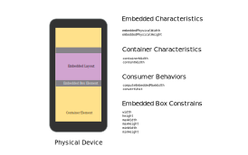

:hide-uri-scheme:
ifdef::env-github[]
:tip-caption: :bulb:
:note-caption: :information_source:
:important-caption: :heavy_exclamation_mark:
:caution-caption: :fire:
:warning-caption: :warning:
endif::[]
:author: Jules Sam. Randolph
:revnumber: 1.0.0
:toc:

= A Deterministic Approach to Images Scaling

|===
|*{author} ― v{revnumber}*
|===

== Introduction

The way images are scaled greatly impacts library consumers experience.
This document is an attempt at specifying behaviors which might not have
been presented to library consumers in the past, to convey consistency
with regard to this library behavior.

== Problem Frame

In this section, we introduce a context to understand the challenges
surrounding scaling of images. In the bellow figure, a React Native
layout sketch is presented with the following objects:

* A Container element, which represents the component responsible for
displaying HTML content;
* A Image Box element, which is the renderer for the `img` HTML element;
* An Image Layout, which represents the surface of the screen
effectively covered by the image to display.

[NOTE]
The relation between the dimensions of the Image Layout and the Image
Box Element is defined by `resizeMode`. The conditions under which these
properties can be passed is out of scope of this document.

____
The problem can be defined as follows:

* *How to determine Box Element width and height which satisfies best
library consumers?*
* *Which API would enable such capabilities?*
____

== Variables

[width="100%",cols="24%,7%,69%",options="header",]
|===
|Variable
|Type
|Definition

|`imagePhysicalWidth`
|pixel
|The pixel width of the image.

|`imagePhysicalHeight`
|pixel
|The pixel height of the image.

|`containerWidth`
|dpi
|The width of the container in which the HTML content is rendered.

|`contentWidth`
|dpi
|`containerWidth` minus inner left and right padding.

|_image box constrains_
|dpi
|See section bellow.
|===

== Image Box Constrains

Image Box Element Constrains are constructed from a range of different
sources:

[arabic]
. styles defined by library consumer for the `img` tag, or for a class
which this `img` element has been given;
. inline styles of the element;
. element attributes such as `width` and `height`.

After having applied the rules of specificity, we end up with a set of
rules which are meant to influence the dimensions of the Image Box
Element. For the sake of simplicity, we will ignore the following
constrains:

* margins and padding;
* constrains expressed in relative units (%, vh);
* constrains on parents in the DOM.

Therefore we have `width`, `height`, `maxWidth`, `maxHeight`, `minWidth`
and `minHeight`, all expressed in dpi. For the sake of clarity, we
introduce new definitions:

* The _minimum constrains_ is the rectangle formed by `minWidth` and
`minHeight`.
* The _maximum constrains_ is the rectangle formed by `maxWidth` and
`maxHeight`.
* The _required constrains_ is the rectangle formed by `width` and
`height`.

Default _minimum constrains_ are (0, 0) and default _maximum constrains_
are (Infinity, Infinity).

== Consumer Behaviors

These functions pertain to ``injected behaviors'' and give library
consumers great flexibility in implementing their own constrains
regarding image scaling logic.

[width="100%",cols="13%,7%,80%",options="header",]
|===
|Variable
|Type
|Definition

|`computeImagesMaxWidth`
|f(dpi) → dpi
|A function of `contentWidth` returning the maximum width of Image Box
Elements. Can return `Infinity` to depict unconstrained widths.

|`convertUnit`
|f(u, val) → dpi
|A function which take a CSS unit and value for conversion to dpi. The details
of challenges surrounding unit conversions will be the subject of a distinct
RFC.
|===

These behaviors have default values for consumer’s comfort sake:

* Default `computeImagesMaxWidth` is defined as identity:
`(contentWidth) => contentWidth`;
* Default `convertUnit` will be defined in a distinct RFC.

== Algorithms

=== Computing Image Box dimensions

Let _box dimensions_ be the `width` and `height` of the Image Box
Element with each width and height `undefined`.

[arabic]
. *If* _required constrains_ `width` and `height` are both defined,
assign _box dimensions_ to the value of _required constrains_. +
*Else if* one of both dimensions of _required constrains_ is defined,
infer the other dimension from the original image aspect ratio
(`imagePhysicalHeight / imagePhysicalWidth`). +
*Else*, assign _box dimensions_ to the result of applying `convertUnit`
to both `imagePhysicalWidth` and `imagePhysicalHeight` with a `"px"`
argument.
. Apply the <<cut-box>> algorithm.

[[cut-box]]
=== Cut Box

Let _box dimensions_ be the `width` and `height` of the Image Box
Element an argument of this algorithm.

[arabic]
. Apply _minimum constrains_ and _maximum constrains_ to _box_
_dimensions_ width and height whilst preserving aspect ratio.
. *If* `computeImagesMaxWidth` function is defined, apply max-width
constrain to _box dimensions_ whilst preserving aspect ratio. +
*Else*, apply `contentWidth` as a max-width constrain to _box
dimensions_ whilst preserving aspect ratio.

== Discussion

The consumer of the library might hold some assumptions depending on how
he expects the content to be rendered. In reality, there are different
approaches and library authors must take into account a variety of
opinions:

[arabic]
. Some consumers will expect images to _never_ overflow the horizontal
axis.
. Other consumers will expect images to be rendered whilst honoring
strictly the inline styles as dictated by HTML authors, even if that
means overflowing the horizontal axis.

This solution can be satisfying for both types of consumers. The
advantages of `computeImagesMaxWidth` are multiple:

* Enable an architecture ready for responsiveness. Screen orientation
changes can be easily and deterministically handled.
* Unopinionated: each consumer can implement the behavior he favors.
* Extensible to any embedded contents.
